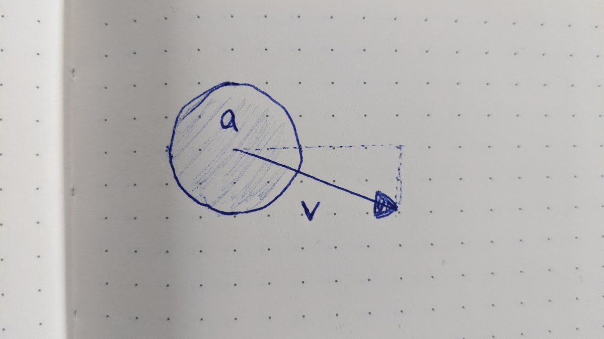
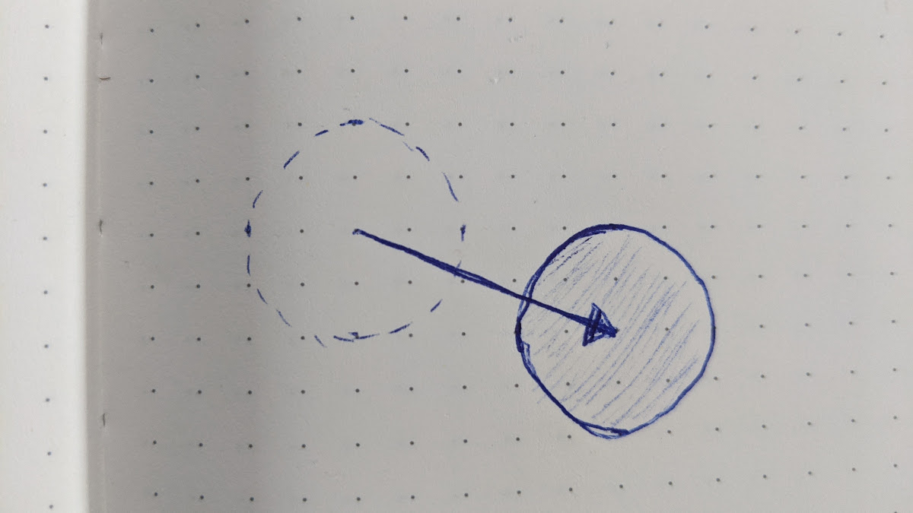
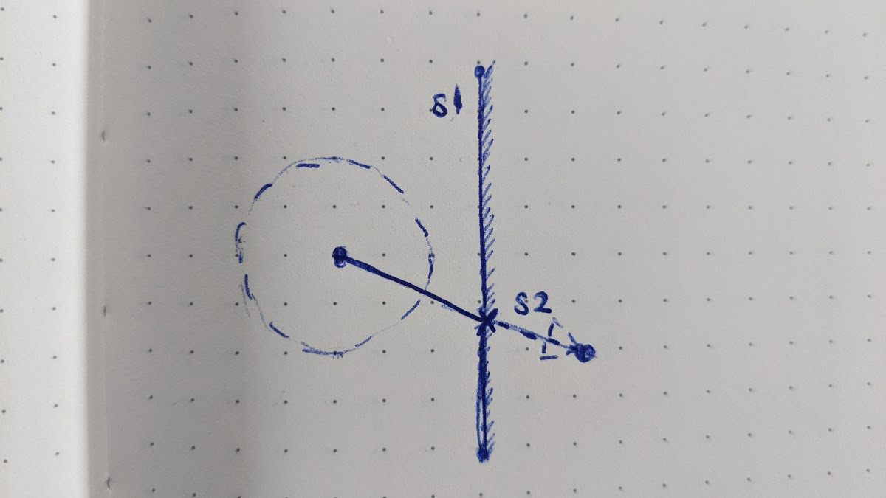

# Interacting With Boundaries

We're going to start formalizing a few geometric concepts in our code. Specifically we're going to be using:

- `Point` - So that we're dealing with our **x** and **y** coordinates in a consistent way, we're going to package them into point structures. All out points are going to be two-dimensional.
- `Segment` - The portion of a line between two points. It's described by two points.
- `Vector` - If you've never worked with mathematical vectors before, you can think of them as an arrow that goes in a certain **direction** for a certain distance (**magnitude**). Alternatively, they're like the arrow (or the displacement or offset) between two points. It's different than a segment, because a segment is fixed in space, whereas the same vector might be used to describe the offset between two different sets of points.

We'll take each of these three concepts one-by-one.

## Vector

Let's create a new module called _geometry.js_ for these concepts. The first thing we'll add to the module is the definition of a `Vector`.

We will most often define a vector using its x and y components, so those are what we will use as constructor arguments, and set on the object. We will want to do various types of vector arithmetic as well. For now, we will add `plus`, `minus`, and `times`:

_geometry.js_:
```js
class Vector {
  constructor(Δx, Δy) {
    this.Δx = Δx
    this.Δy = Δy
  }

  plus(other) {
    return new Vector(
      this.Δx + other.Δx,
      this.Δy + other.Δy,
    )
  }

  minus(other) {
    return new Vector(
      this.Δx - other.Δx,
      this.Δy - other.Δy,
    )
  }

  times(factor) {
    return new Vector(
      this.Δx * factor,
      this.Δy * factor,
    )
  }
}
```

## Point

Next we'll add the definition of a `Point`. A point is simple: it's just an x and y coordinate. We'll also add the ability to get a copy of the point offset along some `Vector`. Add the following to the module:

_geometry.js_:
```js
class Point {
  constructor(x, y) {
    this.x = x
    this.y = y
  }

  offset(vector) {
    return new Point(
      this.x + vector.Δx,
      this.y + vector.Δy,
    )
  }
}
```

## Segment

Finally, a segment is also relatively simple: it is the portion of a line between two points. As for `Point`, we're also going to add a method for creating a new, offset segment.

_geometry.js_:
```js
class Segment {
  constructor(p1, p2) {
    this.p1 = p1
    this.p2 = p2
  }

  offset(vector) {
    return new Segment(
      this.p1.offset(vector),
      this.p2.offset(vector),
    )
  }
}
```

And let's not forget to export these classes so that we can use them elsewhere:

_geometry.js_:
```js
export { Point, Segment, Vector }
```

There's a fair bit we'll need to add to these classes, but for now we're ready to start making some agents bounce off the walls!

## Making an `Agent` Bounce

What we want to happen is, when an `Agent` hits a `Boundary`, the agent should bounce off of it.

Hm.

If you've ever done something like [instruct a robot to make a peanut butter and jelly sandwich](https://www.scientificamerican.com/article/robot-make-me-a-sandwich/), then you know that we haven't described what should happen in nearly enough detail yet. So we'll try again:

For a given `Agent` `a`, any time we call `a.step()`, `a` is moving in some direction with some speed. We'll call the `Vector` that could describe the agent's movement it's `velocity`, or `v` for short.

{: .illustration}

Most of the time, if there's nothing that's in agent `a`'s way, it should just be offset by the vector `v` over the course of a simulation step (that is, specifically, for a step that is 1 time unit long; generally for a step of `Δt` time units, the position of `a` should be offset by the vector `Δp = v .times (Δt)`).

{: .illustration}

However, sometimes there may be an obstacle in the way &mdash; specifically, in this case, a `Boundary`. We can tell whether a given boundary `b` is in the way by checking for collisions between `a` and the `b`. A collision will happen when the path that `a` takes during the course of it's step (which we can describe with a `Segment`) crosses the boundary `b` (which we can describe by another `Segment`).

{: .illustration}

Calculating whether two segments cross is definitely something defined well enough that we can get a computer to do it!

### Crossing Two Segments

Say we have to segments `s1` and `s2`. Each of these is a part of a line. Let's say the equation for the lines that these segments lie on are as follows:

```
y = m1 * x + b1
y = m2 * x + b2
```

Where `m1` and `m2` are the slopes and `b1` and `b2` are the y-intercepts (we'll deal with vertical lines, which have infinite slope no y-intercept, as a special case). If the two slopes are equal, then the lines are parallel and never intersect. Otherwise, we can find their intersection point by solving for `x` and `y`:

```
y = m1 * x + b1
y = m2 * x + b2

m1 * x + b1 = m2 * x + b2
m1 * x - m2 * x = b2 - b1
(m1 - m2) * x = b2 - b1

x = (b2 - b1) / (m1 - m2)
y = (m1 * x + b1) = (m2 * x + b2)
```

But remember, `x` and `y` are the coordinates of the point where the _lines_ cross. The segments only cross if that point is contained within both segments.

Let's add a getter called `slopeintercept` to the `Segment` class that will give us the slope and intercept of a segment's line.

```js
get slopeintercept() {
  const x1 = this.p1.x
  const y1 = this.p1.y
  const x2 = this.p2.x
  const y2 = this.p2.y

  const m = (y2 - y1) / (x2 - x1)
  const b = isFinite(m) ? y1 - m * x1 : null
  return [m, b]
}
```

Let's also add a method called `contains` to the `Segment` class that will tell us whether a given point lies along the segment's line and is between the segment's endpoints.

```js
contains(point) {
  const x1 = this.p1.x
  const y1 = this.p1.y
  const x2 = this.p2.x
  const y2 = this.p2.y

  const {x, y} = point
  const [m, b] = this.slopeintercept
  if (b === null && x !== x1) { return false }
  if (b !== null && y !== m * x + b) { return false}

  return (
    ( (x1 <= x && x <= x2) || (x1 >= x && x >= x2) ) &&
    ( (y1 <= y && y <= y2) || (y1 >= y && y >= y2) )
  )
}
```

Now we can add a `crosses` method to the `Segment` class that will return the point where two segments cross, or `null` if no such point exists (i.e., if the segments do not cross):

```js
crosses(other) {
  const s1 = this
  const s2 = other

  // Calculate the slopes. If they have the same slopes then they never
  // intersect. The one time that two segments might have the same slope but
  // still be parallel is if one is Infinity and the other is -Infinity, but
  // in that case both intercepts will be null.
  const [m1, b1] = s1.slopeintercept
  const [m2, b2] = s2.slopeintercept
  if (m1 === m2) { return null }
  if (b1 === null && b2 === null) { return null }

  // Calculate the intersection point (where y == m1 * x + b1 == m2 * x + b2).
  // Bear in mind in the code below that a null intercept implies a vertical
  // line with an infinite slope.
  const x = ( b1 === null ? s1.x1 : ( b2 === null ? s2.x1 : (b2 - b1) / (m1 - m2) ) )
  const y = ( b1 === null ? m2 * x + b2 : m1 * x + b1 )
  const i = new Point(x, y)

  // If and only if the intersection point is on both segments, it is valid
  if (s1.contains(i) && s2.contains(i)) { return i }
  else { return null }
}
```

### A Note About Real Numbers

Ok, now I'm going to save your future self some headache. If you already know why floating point arithmetic can be troublesome, you can just skip to the end of this section if you'd like. If you don't know what I'm talking about, then try out this instructive exercise.

Create a new HTML file in the same folder with the following contents:

_test_segments.html_:
```html
<html>
<body>
  <script type="module">
    import { Point, Segment } from './geometry.js'

    window.s1 = new Segment(
      new Point(-2, 0.3),
      new Point( 8, 0.3),
    )

    window.s2 = new Segment(
      new Point(-2, 0),
      new Point( 8, 10),
    )
  </script>
</body>
</html>
```

Here, we're creating two line segments. The first goes from `(x=-2, y=0.3)` to `(x=8, y=0.3)`. Since the y-coordinate on each end points is the same (`0.3`), it's a horizontal line. The second is a segment goes from `(x=-2, y=0)` to `(x=8, y=10)`. I did choose this particular segment for an illustrative reason, but there's nothing that makes it particularly special &mdash; it's just one of an infinite number of possible segments that crosses the first one.

Now, in your browser, open up http://localhost:8000/test_segments.html and open the JS console. Once there, run the following:

```js
s1.crosses(s2)
```

You should get a `Point` object with `(x=-1.7, y=0.3)`. Indeed, if you grab a pen and paper and do some calculations you will see that those values are correct. Next, in the JS console again, run the following:

```js
s2.crosses(s1)
```

If you do run that you'll see that the browser tells us `null`. &hellip; But certainly if two segments cross each other then they cross each other from either segment's perspective! Is that somehow not true?!

It is true &mdash; the logic is sound. The problem here is the numbers themselves. In the console, let's try to recreate what the `crosses` method is doing. First, let's get the slope and intercept for `s1`:

```js
[m1, b1] = s1.slopeintercept
```

We get `[ 0, 0.3 ]`. Seems correct. Then, get the slope and intercept for `s2`:

```js
[m2, b2] = s2.slopeintercept
```

Here we get `[ 1, 2 ]`. Cool. Using those values, calculate the x-coordinate of their intersection point:

```js
x = (b2 - b1) / (m1 - m2)
```

It should come out to `-1.7`. Again, if you find the intersection with pen and paper, you can verify that this value is correct. Now let's find the y-coordinate in each of two ways:

```js
m1 * x + b1
m2 * x + b2
```

For the first, you see that we arrive at `y=0.3`. This is the method used when we rum `s1.crosses(s2)`, but for the second we get something like `y=0.30000000000000004`. You can find a pretty decent explanation of why this is happening in this JavaScript.io article on "Imprecise Calculations": https://javascript.info/number#imprecise-calculations.

In the latter case, where the y-coordinate was 0.3 plus some, our `contains` function is going to turn up `false`, since `0.30000000000000004 <= 0.3` is `false`. It's almost never safe to use equality or inequality comparisons directly like this on floating point numbers. Instead, to check whether two floating point numbers are equal, you should allow for some approximation.

In our _utils.js_ module, let's add a few functions to help with these floating point number comparisons.

_utils.js_:
```js
...

// Floating point math is, literally, the devil. So, let's use a threshold
// of 6 decimal places for all of our numbers.
function eq(a, b, t=0.000001) { return (b - t <= a && a <= b + t) }
function lte(a, b, t=0.000001) { return (a <= b + t) }
function gte(a, b, t=0.000001) { return (a >= b - t) }

export { eq, lte, gte, zipLongest }
```

Using these, of two numbers are equal out to 6 decimal places, we'll count them as actually equal. Why 6 places? We have to pick some threshold. The more decimal places we require to be equal, the more likely imprecision will affect us. I just made a call that 6 places of precision was enough.

Now let's use these to improve our `Segment.contains` method. At the top of the _geometry.js_ module, add:

```js
import { eq, lte, gte } from './utils.js'
```

Then, replace the `contains` method with the following:

```js
contains(point) {
  const x1 = this.p1.x
  const y1 = this.p1.y
  const x2 = this.p2.x
  const y2 = this.p2.y

  const {x, y} = point
  const [m, b] = this.slopeintercept
  if (b === null && !eq(x, x1)) { return false }
  if (b !== null && !eq(y, m * x + b)) { return false}

  let lteChain = (a, b, c) => lte(a, b) && lte(b, c)
  let gteChain = (a, b, c) => gte(a, b) && gte(b, c)

  return (
    ( lteChain(x1, x, x2) || gteChain(x1, x, x2) ) &&
    ( lteChain(y1, y, y2) || gteChain(y1, y, y2) )
  )
}
```

Now if we open out _test_segments.html_ page again, we should see values for both `s1.crosses(s2)` and `s2.crosses(s1)`.

### Detecting Collisions

Now that we have the math worked out for our segment crossing detector, we can use the functions we've created in our simulation steps. First let's update our models to use the geometric concepts. I'm going to post updates to the `Agent` and `Boundary` models below without much explanation, but I encourage you to read through the changes.

_model.agent.js_:
```js
class Agent {
  constructor(params) {
    this.position = params.position || new Point(params.x, params.y)
    this.velocity = params.velocity || new Vector(
        Math.cos(direction) * magnitude,
        Math.sin(direction) * magnitude,
      ))
    this.radius = params.radius
    this.time = params.time || 0
  }

  get x() { return this.position.x }
  get y() { return this.position.y }

  step(Δt=1) {
    // Calculate the change in position based on how much time has elapsed (Δt)
    const Δp = this.velocity .times (Δt)

    // Calculate new position
    const position = this.position.offset(Δp)

    // Calculate the new time
    const time = this.time + Δt

    return new Agent({
      ...this,
      position,
      time,
    })
  }
}
```

_model.boundary.js_:
```js
class Boundary {
  constructor(params) {
    this.segment = new Segment(
      new Point(params.x1, params.y1),
      new Point(params.x2, params.y2),
    )
  }

  get x1() { return this.segment.x1 }
  get y1() { return this.segment.y1 }
  get x2() { return this.segment.x2 }
  get y2() { return this.segment.y2 }
}
```

Using these new and improved models, we can update our `World.step` method.

```js
step(Δt=1) {
  let bounceIfCollided = (oldAgent, newAgent) => {
    const path = new Segment(oldAgent.position, newAgent.position)

    for (const boundary of this.boundaries) {
      const threshold = boundary.segment
      if (path.crosses(threshold)) {
        console.log('Agent crossed a boundary and needs to bounce!')
      }
    }

    return newAgent
  }

  const agents = this.agents.map(a => bounceIfCollided(a, a.step(Δt)))
  const time = this.time + Δt

  return new World({
    ...this,
    agents,
    time,
  })
}
```

If you fire up your original page and open the JS console, you should see a message get logged every time one of your agents crosses a boundary. This is great in that it shows that our simulation knows when we _should_ bounce, but now we have to teach it _how_ to bounce.

### Calculating a New Velocity After a Bounce

We want our bounces to be modeled roughly after elastic collisions against a stationary object. This basically means that the agent's speed is going to be the same after colliding as before. What we have to calculate is the new direction.

First, a quick primer on real-world collisions. If an ball collides with a stationary surface (i.e. the surface of an object with a much larger mass than the ball), a force will be exerted on the ball in a direction perpendicular (a.k.a., ["normal"](https://en.wikipedia.org/wiki/Normal_%28geometry%29)) to the surface. This is true regardless of the direction of approach of the ball, or where on the surface the ball hits. The vector with a length of 1 that corresponds to this perpendicular direction of force is known as the **normal** of the surface.

**illustration**

If the surface has curvature to it, then each point along the surface may have a different normal calculated as the vector that is perpendicular to the tangent of the surface at that point.

**illustration**

All of our boundaries are straight, so we don't have to worry about the curvature case &hellip; for now &#128527;. If a ball collides with two surfaces simultaneously (say, at a corner) then we can add the normals of each of those surfaces at the points of collision to get the direction of impact that will be applied to the ball (real physics is more nuanced than this, but the physics isn't even the main point of the model that we're building, so let's just get something that looks about right and move on).

**illustration**

Once we know the direction of impact applied to the ball, we can determine the ball's after-bounce direction of motion. We can split the ball's velocity into a component that is parallel to the normal vector and a component that is perpendicular. We want a new `Vector` that maintains the component of the velocity that is perpendicular to the normal vector, but negates the parallel component.

**illustration**

This parallel component of the velocity is called the **projection** of the velocity onto the normal. To calculate the projection we can use an operation called the **dot product**. The dot product of two vectors `a` and `b`, usually written `a • b`, is defined as follows:

```
a • b = a.x * b.x + a.y * b.y
```

We'll also need to take something called a **unit vector** into account. A unit vector of a vector `a` is simply the vector of length 1 that has the same direction as `a`. We can calculate the unit vector by dividing each of `a`'s components by the total length, or **magnitude**, of `a` (written as `|a|`). We'll write the unit vector as `a¹`.

```
a¹ = a / |a|
```

It can be shown that the projection of a vector `a` onto another vector `b`  (let's write this as `a → b`) is equal to `b¹` times the dot product of `a` and `b` divided by the magnitude of `b`. The [derivation](http://www.sunshine2k.de/articles/Derivation_DotProduct_R2.pdf) of this is actually quite interesting, but I won't go over it here.

```
a → b = b¹ * (a • b) / |b|
```

Great! Now we have all the pieces we need to calculate our bounce.

So, let's say we have the normal vector (`n`) to the boundary that exerts an [impulse](https://www.khanacademy.org/science/physics/linear-momentum/momentum-tutorial/a/what-are-momentum-and-impulse) (`i`) on an agent colliding with it. If we take the current velocity (`v`) of the agent, we can find the impulse applied to the agent by projecting the agent's velocity onto the normal and negating it (think of this as a form of [Newton's third law of motion](https://www.khanacademy.org/science/physics/forces-newtons-laws/newtons-laws-of-motion/a/what-is-newtons-third-law) &mdash; every action has an equal and opposite reaction). The final velocity (`vf`) of the agent can be calculated by adding the impulse vectors of everything that acts on the agent (e.g., the agent could collide with two boundaries at once), projecting the initial velocity onto the sum of impulse vectors, and scaling resulting vector by 2 so that the final velocity has the same magnitude as the agent's initial velocity (this of this as a kind of [conservation of momentum](https://www.khanacademy.org/science/physics/linear-momentum/momentum-tutorial/a/what-is-conservation-of-momentum)).

```
i = sum of (-v → n) for each collision
vf = v + (-v → i) * 2
```

Great! Let's start implementing some of our new concepts. Just as a recap, here's the pieces we're going to use to bounce:

* The **magnitude** of a vector
* The **unit** vector of a vector
* The **normal** vector to a boundary
* The **dot product** of two vectors
* The **projection** of one vector onto another

Let's get started.

### Vector magnitude

Add the following getter method to the `Vector` class:
```js
get magnitude() {
  return Math.sqrt(this.Δx * this.Δx + this.Δy * this.Δy)
}
```

### Vector unit

Add the following getter method to the `Vector` class:
```js
get unit() {
  const magnitude = this.magnitude
  if (magnitude === 1) { return this }
  return new Vector(
    this.Δx / magnitude,
    this.Δy / magnitude,
  )
}
```

### Boundary normal

Add the following getter method to the `Boundary` class:
```js
get normal() {
  const x1 = this.segment.p1.x
  const y1 = this.segment.p1.y
  const x2 = this.segment.p2.x
  const y2 = this.segment.p2.y

  const orthogonal = new Vector(
    y2 - y1,
    x1 - x2,
  )
  return orthogonal.unit
}
```

### Dot product of vectors

Add the following method to the `Vector` class:
```js
dot(other) {
  return this.Δx * other.Δx + this.Δy * other.Δy
}
```

### Projection of one vector onto another

Add the following method to the `Vector` class:
```js
projected(other) {
  const magnitude = other.magnitude
  return other .times (this.dot(other) / magnitude / magnitude)
}
```

### Implementing `Agent.bounce`

Finally, we can add a method for creating the post-bounce state of an `Agent`. We are going to add a `bounce` method to `Agent` that takes a set of normal vectors of the objects that the agent is bouncing off of, and constructs and returns a new `Agent` with a post-bounce velocity. that method looks like this:

```js
bounce(normals) {
  if (normals.length === 0) { return this }

  // Get the initial velocity vector
  const v = this.velocity

  // Construct an effective normal by projecting the velocity onto each of
  // the collision normals, and then negating the resulting impact vectors.
  // Think of this as a form of Newton's third law of motion -- every action
  // has an equal and opposite reaction.
  const n = normals
    .map(n => v.projected(n))
    .reduce((i1, i2) => i1 .minus (i2), new Vector(0, 0))

  // The effective normal gives us the direction of impact on the agent. The
  // agent's final velocity should have the same magnitude as the initial
  // velocity -- think of this as a kind of conservation of momentum.
  const i = v.projected(n) .times (-2)

  // Calculate the new velocity vector
  const velocity = v .plus (i)

  return new Agent({
    ...this,
    velocity
  })
}
```

Holy smokes, we are so close here. Let's incorporate this into the `World.step` method:

```js
step(Δt=1) {
  let bounceIfCollided = (oldAgent, newAgent) => {
    const path = new Segment(oldAgent.position, newAgent.position)
    const velocity = oldAgent.velocity
    const radius = newAgent.radius

    let collisionNormals = []
    for (const boundary of this.boundaries) {
      // First we figure out which side of the boundary the original agent
      // center was on. There is a good explanation of why the following does
      // that at https://math.stackexchange.com/a/274728/783341.
      const side = ((oldAgent.x - boundary.x1) * (boundary.y2 - boundary.y1) -
                    (oldAgent.y - boundary.y1) * (boundary.x2 - boundary.x1)) >= 0 ? 1 : -1

      // We use that side to determine the correct orientation for our normal
      // (because it matters if it's pointing toward the agent or away from
      // it).
      const normal = boundary.normal .times (side)

      // If the dot product of the normal and the agent's velocity is not
      // negative, then the agent is moving away from the boundary, and so
      // shouldn't collide with it.
      if (velocity.dot(normal) >= 0) { continue }

      // Then we determine a threshold of how near the agent should be able
      // to get to the boundary before we consider it a collision. We use the
      // agent's radius to determine how far offset from the boundary the
      // threshold should be.
      const threshold = boundary.segment.offset(normal .times (radius))

      // Finally, if the agent's path crosses that threshold, we collect the
      // boundary's normal as one of the collision normals.
      if (path.crosses(threshold)) {
        collisionNormals.push(normal)
      }
    }

    return newAgent.bounce(collisionNormals)
  }

  const agents = this.agents.map(a => bounceIfCollided(a, a.step(Δt)))
  const time = this.time + Δt

  return new World({
    ...this,
    agents,
    time,
  })
}
```

----------

In the next section we'll go over how to detect agents' interactions with other agents.

[Interacting With Other Agents](interacting-with-agents){: .btn}