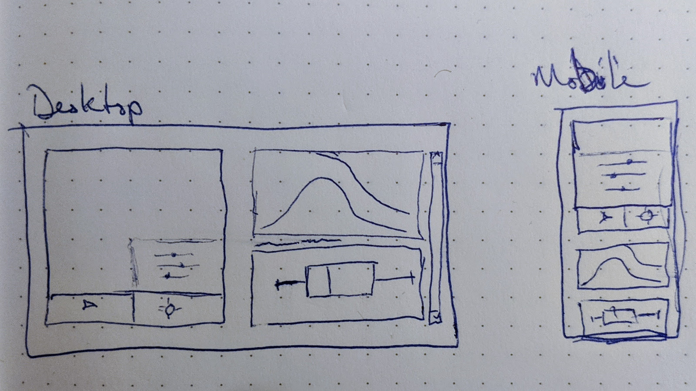

# Initial Setup

When I got started, I put little bit of time into what I wanted the layout of my project to be. I know I want it to be responsive (why not). I know I want to show a simulation, and graphs that are updating as the simulation runs. I know that I want to be able to tweak some parameters in the simulation directly from the UI.

Here's a sketch of what's in my mind:

What we're looking at here (apologies for my sketches) are two versions of the same interface, in each version there's a large simulation area (on the left in the _Desktop_ sketch, and at the top in the _Mobile_ sketch) overlayed by a collapsible settings box. In the settings box there are sliders to adjust simulation parameters (we'll get to that later).

Opposite the simulation area (to the right, or below) is a set of charts that the user can scroll through. We will also some back to what these charts will show.